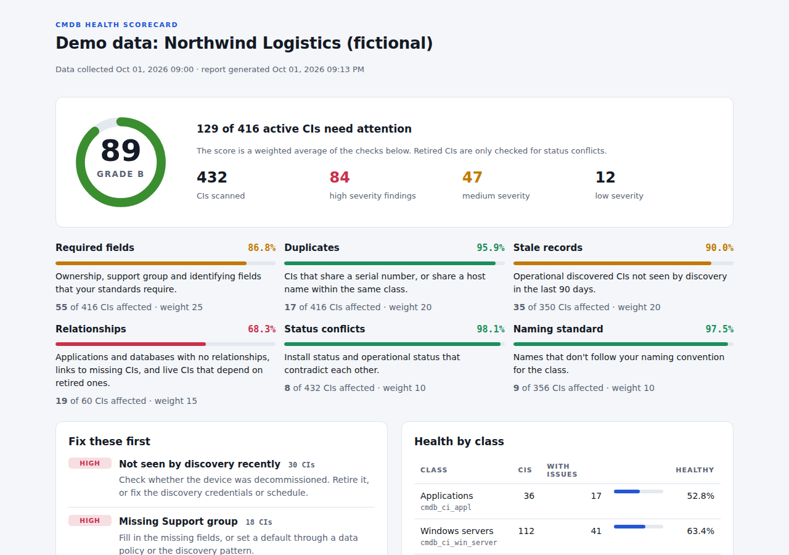

# CMDB Health Scorecard


A command-line tool that scans a ServiceNow CMDB, scores its health from 0 to 100, and tells you exactly which CIs to fix and how.

Every CMDB drifts: a second discovery source creates duplicates, servers get decommissioned but never retired, applications get added with no owner and nothing mapped underneath them. The CMDB Health dashboard inside ServiceNow shows some of this, but it needs setup and licensing, and it doesn't hand you a prioritized fix list. This tool does that in one command, using only read access.



**Try it without an instance:** `python -m cmdb_health --demo` runs against a built-in sample CMDB for a fictional logistics company, with realistic problems planted in it.

## What it checks

| Check | What it catches | Default weight |
|---|---|---|
| Required fields | Missing owner, support group, serial number, asset tag, IP or location, per class. Vendor placeholder serials like `To Be Filled By O.E.M.` count as missing. | 25 |
| Duplicates | CIs sharing a serial number (ignoring case, spaces and dashes), or sharing a host name within a class, so `hou-win-sql-01` and `HOU-WIN-SQL-01.corp.local` match. The most recently discovered record is kept as the survivor. | 20 |
| Stale records | Operational, discovered CIs not seen by discovery in 90 days, or never discovered at all. | 20 |
| Relationships | Applications and databases with no relationships, links to CIs that were deleted, and live CIs that still depend on retired ones. | 15 |
| Status conflicts | Install status Retired while operational status is still Operational, and the reverse. | 10 |
| Naming standard | Names that break your convention, such as default Windows names like `WIN-7F3K2QJ9`. | 10 |

Every threshold, required field, naming pattern and weight can be changed with a JSON rules file (see [examples/rules.example.json](examples/rules.example.json)).

## Output

Each run writes three files to `reports/`:

- **`cmdb_health_report.html`**: a self-contained scorecard with the overall grade, a card per check, a "fix these first" list ranked by impact, health by CI class, and a searchable table of every finding. Open the [sample report](sample_report/cmdb_health_report.html) to see it.
- **`cmdb_findings.csv`**: one row per problem with the CI's sys_id and a suggested fix, ready to hand to the owning teams or turn into tasks.
- **`cmdb_health_summary.json`**: the scores in machine-readable form, for tracking the trend over time or feeding a dashboard.

Terminal output from the demo:

```
  CMDB health: 88.7 / 100  (grade B)
  129 of 416 active CIs have at least one issue

  Required fields     86.8%     55 affected of 416
  Duplicates          95.9%     17 affected of 416
  Stale records       90.0%     35 affected of 350
  Relationships       68.3%     19 affected of 60
  Status conflicts    98.1%      8 affected of 432
  Naming standard     97.5%      9 affected of 356

  Fix first:
   - Not seen by discovery recently (30)
   - Missing Support group (18)
   - Duplicate serial numbers (11)
```

## Quick start

Requires Python 3.10 or newer.

```bash
git clone https://github.com/YOUR-GITHUB-USERNAME/cmdb-health-scorecard.git
cd cmdb-health-scorecard
pip install -r requirements.txt

python -m cmdb_health --demo --open
```

On Windows, use `py` in place of `python` if `python` isn't on your PATH.

## Running against a real instance

1. Get a free Personal Developer Instance at [developer.servicenow.com](https://developer.servicenow.com) if you don't want to point this at a work instance.
2. Create a user with read access to `cmdb_ci` and `cmdb_rel_ci` (the `itil` role is enough on a PDI; in production, a dedicated read-only integration user is better).
3. Copy `.env.example` to `.env` and fill it in. `.env` is git-ignored, so credentials never get committed.
4. Run it:

```bash
python -m cmdb_health --live --open
python -m cmdb_health --live --classes cmdb_ci_win_server,cmdb_ci_linux_server
python -m cmdb_health --live --rules my_rules.json
```

The tool only sends GET requests to the Table API. It pages through results 1,000 records at a time, retries when the instance throttles it (HTTP 429), and gives a clear message for bad credentials or missing roles. Nothing in the CMDB is changed.

### Using it as a quality gate

`--fail-under` makes the command exit with code 1 when the score drops below a threshold, so it can run on a schedule in a pipeline and alert someone:

```bash
python -m cmdb_health --live --fail-under 85
```

## How the score works

Each check has a pass rate: the share of the CIs it looked at that had no problems. The overall score is the weighted average of those pass rates. Grades: A is 90 and up, B 80 to 89, C 70 to 79, D 60 to 69, F below 60.

Retired CIs are left out of every check except status conflicts, since a retired server with no support group isn't a problem worth anyone's time.

## Project layout

```
cmdb_health/
  cli.py            command-line entry point
  checks.py         the six health checks
  scoring.py        weighted score, grade, per-class breakdown
  report.py         HTML, CSV and JSON output
  config.py         default rules, overridable with JSON
  models.py         CI, Relationship and Finding data classes
  sources/
    demo.py         repeatable sample CMDB with planted problems
    servicenow.py   Table API client (pagination, retries, auth)
tests/              24 unit tests, no network needed
```

## Tests

```bash
python -m unittest discover -s tests -t .
```

The ServiceNow client is tested against a fake HTTP session, covering pagination, throttling retries, bad credentials and reference field parsing, so the suite runs offline. GitHub Actions runs it on Windows and Linux for every push.

## Ideas for next versions

- Write findings back to ServiceNow as remediation tasks assigned to each CI's support group
- Track the score over time and chart the trend
- Check relationship rules per class, for example every database instance must run on a server
- Package as a scoped app with a scheduled job, so it runs inside the instance

## Author

Built by Kester Atuanya, Senior ServiceNow Developer (CIS-ITSM, CIS-SAM, CIS-CAD, CSA).

## License

MIT
